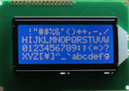

# Components
Examples the components and using with Arduino, Raspberry Pi, BlackBone and others devices

|                                                               |                                                                                       |
| ------------------------------------------------------------- | ------------------------------------------------------------------------------------- |
|  | [Serial LCD I2C Module with chip PCF8574](./Serial%20LCD%20I2C%20Module%20with%20chip%20PCF8574) |
| Futures                                                       |                                                                                       |
|                    | 1 - Module LCD Nokia 5110                                                             |
|  | 2 - 16x2 LCD Display White-Blue LED Backlight                                       |
|  | 3 - 16x4 LCD Display White-Blue LED Backlight                                       |
|             | 4 - 3.2 inch TFT LCD Screen Module                                                  |