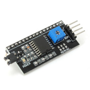
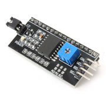
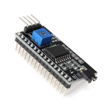
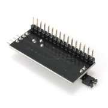
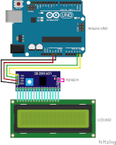
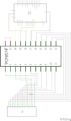
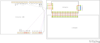
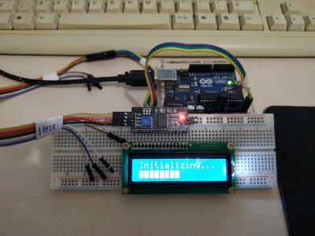
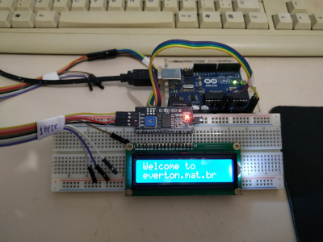
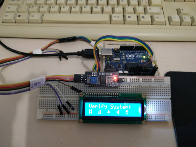

# Serial LCD I2C Module with chip PCF8574
Example of use with components "Serial LCD I2C Module with chip PCF8574" and "16x2 LCD Display White-Blue LED Backlight".

This code (download [here](./sample/informations/informations.ino){target="_blank"} the complete and with comments) to execute in the Arduino UNO.

Note this code the value of "LCD_ADDR" is 0x3F is not 0x20. Use the project [here](./sample/scanner/scanner.ino){target="_blank"} (find in the web, I not created)  to get address to module.

I use the [New LiquidCrystal](https://bitbucket.org/fmalpartida/new-liquidcrystal/wiki/Home){target="_blank"} libray to execute this project.

```
/*
 Arduino      Module
 A4  (SDA)    SDA
 A5  (SCL)    SCL
 VCC (5V)     VCC
 GND (0V)     GND
*/

#include <Wire.h> 
#include <LiquidCrystal_I2C.h>

#define NUMBER_COLUMNS 16
#define NUMBER_ROWS    2
#define CHAR_SIZE      LCD_5x8DOTS

#define LCD_ADDR       0x3F
#define PIN_EN         2
#define PIN_RW         1
#define PIN_RS         0

#define PIN_D4         4
#define PIN_D5         5
#define PIN_D6         6
#define PIN_D7         7

#define PIN_BACKLIGHT  3

LiquidCrystal_I2C lcd( LCD_ADDR, PIN_EN, PIN_RW, PIN_RS, PIN_D4, PIN_D5, PIN_D6, PIN_D7, PIN_BACKLIGHT, POSITIVE );

byte dataMobile[8] = {
  0b10001,
  0b10011,
  0b10101,
  0b10001,
  0b10001,
  0b10101,
  0b11001,
  0b10001
};

byte note[8] = {
  0b00000,
  0b00011,
  0b00101,
  0b01001,
  0b01001,
  0b01011,
  0b11011,
  0b11000
};

byte notification[8] = {
  0b00000,
  0b00100,
  0b01110,
  0b01110,
  0b01110,
  0b11111,
  0b00000,
  0b00100
};

byte sound[8] = {
  0b00001,
  0b00011,
  0b00111,
  0b11111,
  0b11111,
  0b00111,
  0b00011,
  0b00001
};

byte power[8] = {
  0b01010,
  0b01010,
  0b11111,
  0b10001,
  0b10001,
  0b01110,
  0b00100,
  0b00100
};

void verifyProcess();

void setup(){
  lcd.begin( NUMBER_COLUMNS, NUMBER_ROWS, CHAR_SIZE );

  lcd.createChar( 0, (uint8_t *)dataMobile );
  lcd.createChar( 1, (uint8_t *)note );
  lcd.createChar( 2, (uint8_t *)notification );
  lcd.createChar( 3, (uint8_t *)sound );
  lcd.createChar( 4, (uint8_t *)power );

  lcd.setBacklight( HIGH );

  lcd.home();
  lcd.clear();
  lcd.print( "Initializing..." );
  lcd.setCursor( 0, 1 );
  for( unsigned char i=0; i<NUMBER_COLUMNS; i++ ){
    delay( random(1000, 2000) );
    lcd.write( byte(0b11111111) );
  }
  delay( 1000 );

  lcd.home();
  lcd.clear();
  lcd.print( "Process: OK" );
  delay( 1000 );
 
  lcd.home();
  lcd.clear();
  lcd.print( "Welcome to" );
  lcd.setCursor( 0, 1 );
  lcd.print( "everton.mat.br" );
  delay( 3000 );
}

void loop(){
  verifyProcess();
  delay( 3000 );
}

void verifyProcess(){
  lcd.home();
  lcd.clear();
  lcd.print( "Verify System:" );
  lcd.setCursor( 0, 1 );
  lcd.write( byte(0) );
  lcd.print( "  " );
  lcd.write( byte(1) );
  lcd.print( "  " );
  lcd.write( byte(2) );
  lcd.print( "  " );
  lcd.write( byte(3) );
  lcd.print( "  " );
  lcd.write( byte(4) );
  delay( 5000 );
  
  lcd.home();
  lcd.clear();
  lcd.write( byte(0) );
  lcd.setCursor( 0, 1 );
  lcd.print( "Data Mobile: OK" );
  delay( 2000 );

  lcd.home();
  lcd.clear();
  lcd.write( byte(1) );
  lcd.setCursor( 0, 1 );
  lcd.print( "Musics: OK" );
  delay( 2000 );

  lcd.home();
  lcd.clear();
  lcd.write( byte(2) );
  lcd.setCursor( 0, 1 );
  lcd.print( "Notification: OK" );
  delay( 2000 );

  lcd.home();
  lcd.clear();
  lcd.write( byte(3) );
  lcd.setCursor( 0, 1 );
  lcd.print( "Sounds: OK" );
  delay( 2000 );

  lcd.home();
  lcd.clear();
  lcd.write( byte(4) );
  lcd.setCursor( 0, 1 );
  lcd.print( "Power: OK" );
  delay( 2000 );
}
```

This images of the module is:

|                                                                          |                                                                          |
| ------------------------------------------------------------------------ | ------------------------------------------------------------------------ |
| [](./Figure_1.jpg){target="_blank"} | [](./Figure_2.jpg){target="_blank"} |
| [](./Figure_3.jpg){target="_blank"} | [](./Figure_4.jpg){target="_blank"} |

This images of the breadboard, schematic and PCB are make in [Fritzing](https://fritzing.org/){target="_blank"} and download this project [here](./sample/sample.fzz) and [arduino](./sample/sample.ino){target="_blank"}:

|                                                                                            |                                                                                                        |
| ------------------------------------------------------------------------------------------ | ------------------------------------------------------------------------------------------------------ |
| [](./sample/sample_bb.png){target="_blank"}   | [](./sample/sample_schematic.png){target="_blank"} |
| [](./sample/sample_pcb.png){target="_blank"} |                                                                                                        |

Here have the figures showing running

|                                                                                                |                                                                                                |
| ---------------------------------------------------------------------------------------------- | ---------------------------------------------------------------------------------------------- |
| [](./IMG_20200112_004319.jpg){target="_blank"} | [](./IMG_20200112_004332.jpg){target="_blank"} |
| [](./IMG_20200112_004242.jpg){target="_blank"} |                                                                                                |

Thanks by see my works ;)